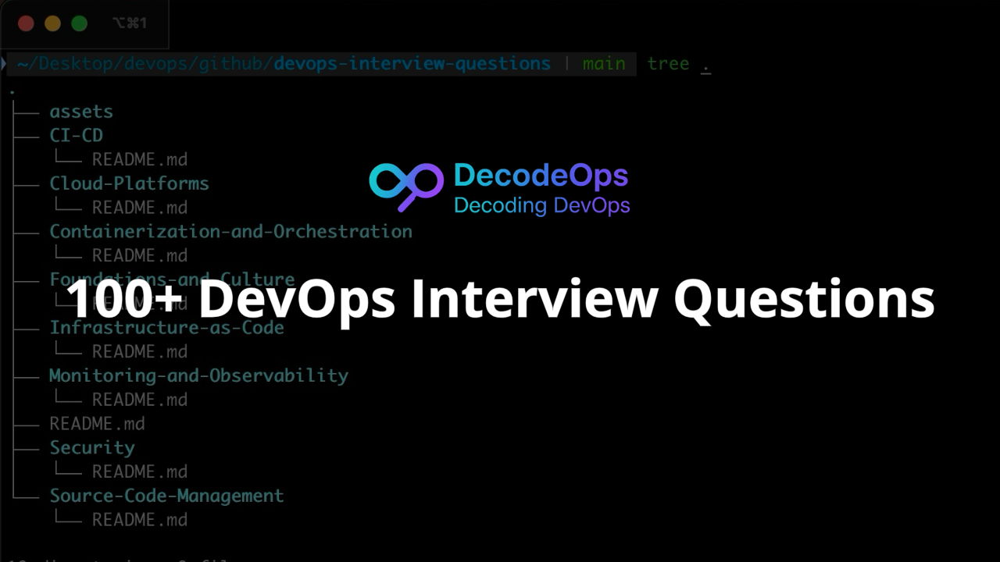

# DevOps Interview Questions
⭐ If you find this helpful, please star the repository! ⭐

Devops interview questions from basic to advance. Please create PRs if you wanna add new or update existing questions.

This project is designed to be a comprehensive guide for anyone involved in software development and IT operations. Whether you're a junior engineer trying to understand the fundamentals or a seasoned pro looking to sharpen your skills, you'll find valuable insights here.

## Repository Structure

The repository is organized by key DevOps pillars. Each directory contains a `README.md` file with questions and answers categorized by difficulty:

* **<a href= "https://github.com/bhanubokkasam/devops-interview-questions/tree/main/Foundations-and-Culture#foundations-and-culture">Foundations-and-Culture</a>**: The principles and mindset behind DevOps.
* **<a href= "https://github.com/bhanubokkasam/devops-interview-questions/tree/main/Source-Code-Management#source-code-management">Source-Code-Management</a>**: Deep dive into Git and branching strategies.
* **<a href= "https://github.com/bhanubokkasam/devops-interview-questions/tree/main/CI-CD#cicd-continuous-integration-continuous-delivery-continuous-deployment">CI-CD</a>**: Continuous Integration, Delivery, and Deployment.
* **<a href= "https://github.com/bhanubokkasam/devops-interview-questions/tree/main/Infrastructure-as-Code#infrastructure-as-code-iac">Infrastructure-as-Code</a>**: Managing infrastructure with code (Terraform, Ansible, etc.).
* **<a href= "https://github.com/bhanubokkasam/devops-interview-questions/tree/main/Containerization-and-Orchestration#containerization-and-orchestration">Containerization-and-Orchestration</a>**: Docker and Kubernetes.
* **<a href= "https://github.com/bhanubokkasam/devops-interview-questions/tree/main/Monitoring-and-Observability#monitoring-and-observability">Monitoring-and-Observability</a>**: Logging, Metrics, and Tracing.
* **<a href= "https://github.com/bhanubokkasam/devops-interview-questions/tree/main/Security#security-devsecops">Security</a>**: DevSecOps principles and practices.
* **<a href= "https://github.com/bhanubokkasam/devops-interview-questions/tree/main/Cloud-Platforms#cloud-platforms">Cloud-Platforms</a>**: AWS, Azure, and GCP in a DevOps context.

For more weekly insights on DevOps, subscribe to my newsletter: https://tinyurl.com/decodeops-newsletter